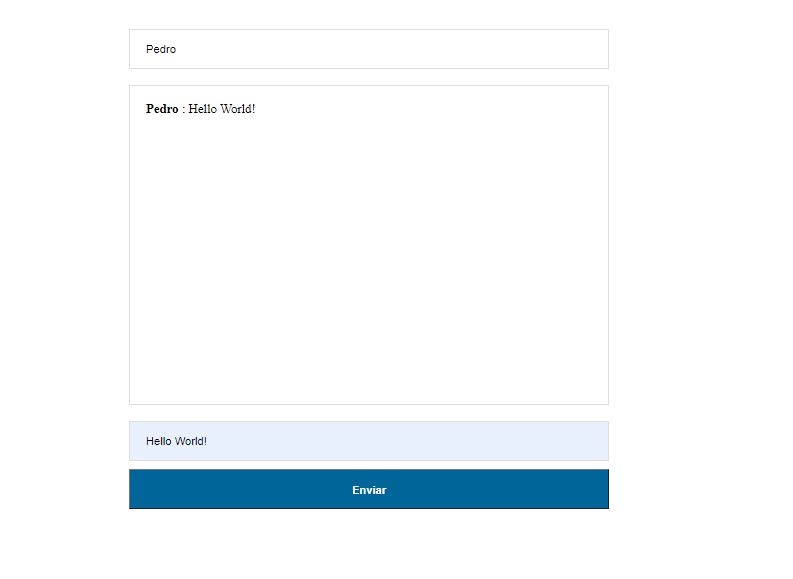

# Chat RealTime

  <a href="#-projeto">Projeto</a>&nbsp;&nbsp;&nbsp;|&nbsp;&nbsp;&nbsp;
  <a href="#-tecnologias">Tecnologias</a>&nbsp;&nbsp;&nbsp;|&nbsp;&nbsp;&nbsp;
  <a href="#-começando">Começando</a>&nbsp;&nbsp;&nbsp;|&nbsp;&nbsp;&nbsp;
  <a href="#memo-licença">Licença</a>

## 💻 Projeto
Chat RealTime é uma app de chat de tempo real utilizando o Node e Socket.io

## 🚀 Tecnologias
- [Node.js](https://nodejs.org)
- [Socket.io](https://socket.io/)

## Começando

- Clone esse repositório `git clone https://github.com/pedroduarte2005/ts-auth.git `
- Instale as Depedências `yarn` ou `npm install`
- Rode o Projeto `node server.js`

## :memo: Licença

Esse projeto está sob a licença MIT. Veja o arquivo [LICENSE](LICENSE.md) para mais detalhes.

Feito com ♥ by Pedro Duarte :wave:
